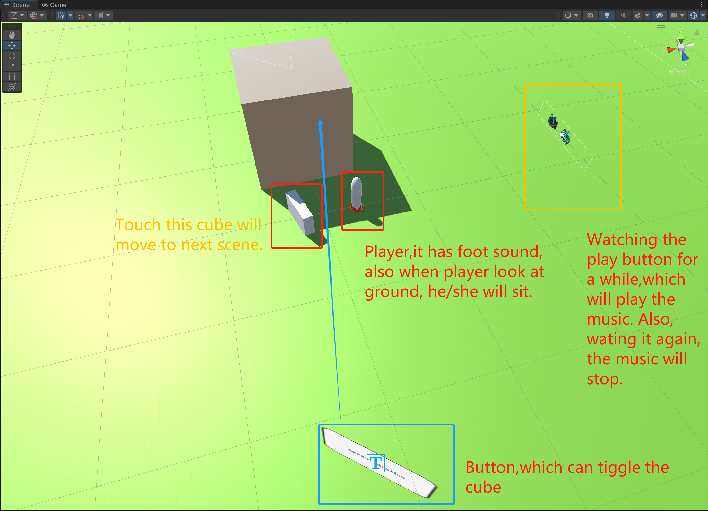

# unity-vr-cardboard-project-demo-code
This is a demo. Please follow the instructions.

## How to use it

* Download this zip file then zip it.
* Open the `Assets` folder then find the `a1.unity` file.
* Open it.

## Important
Remember to install `Google Cardboard XR Plugin for Unity` in the package manager in Unity, I am using the version 1.7.

Cheers, happy coding.
Chao

